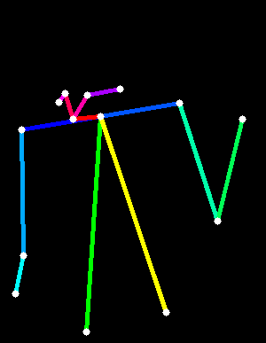
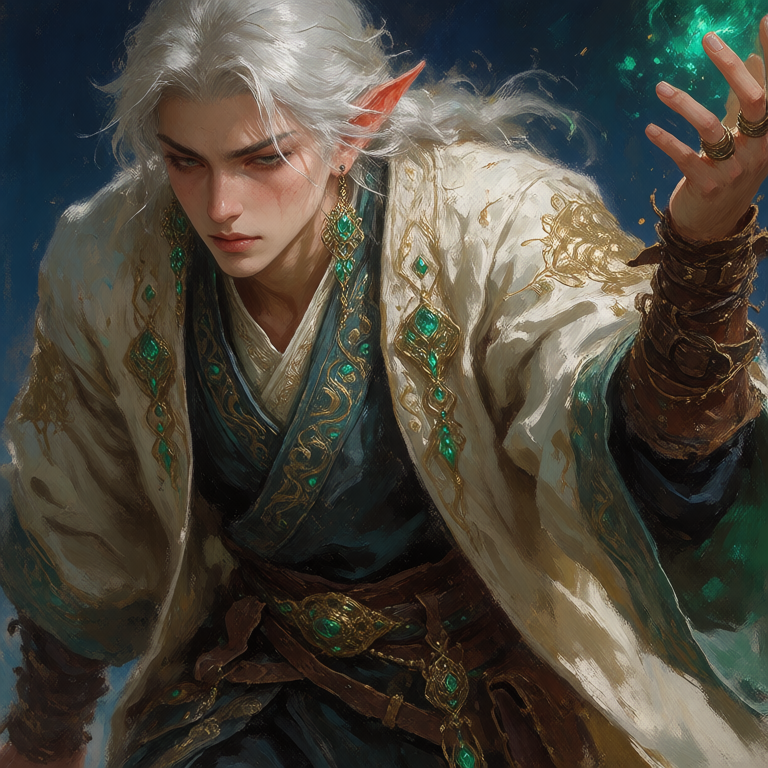
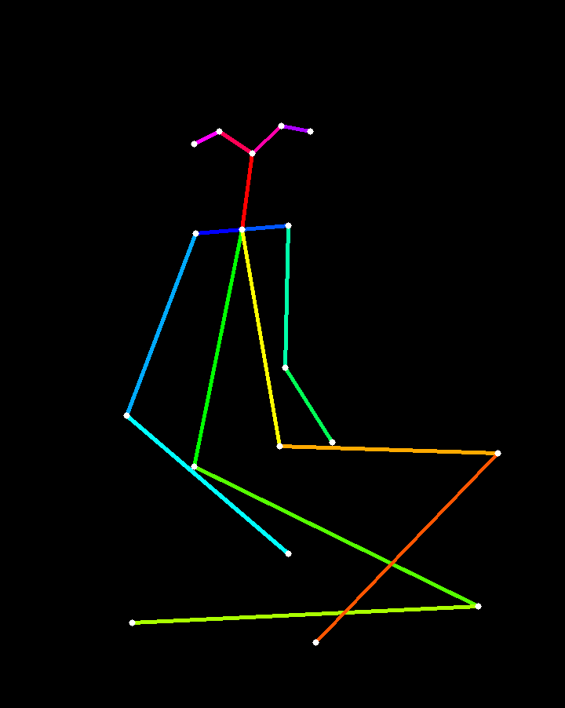
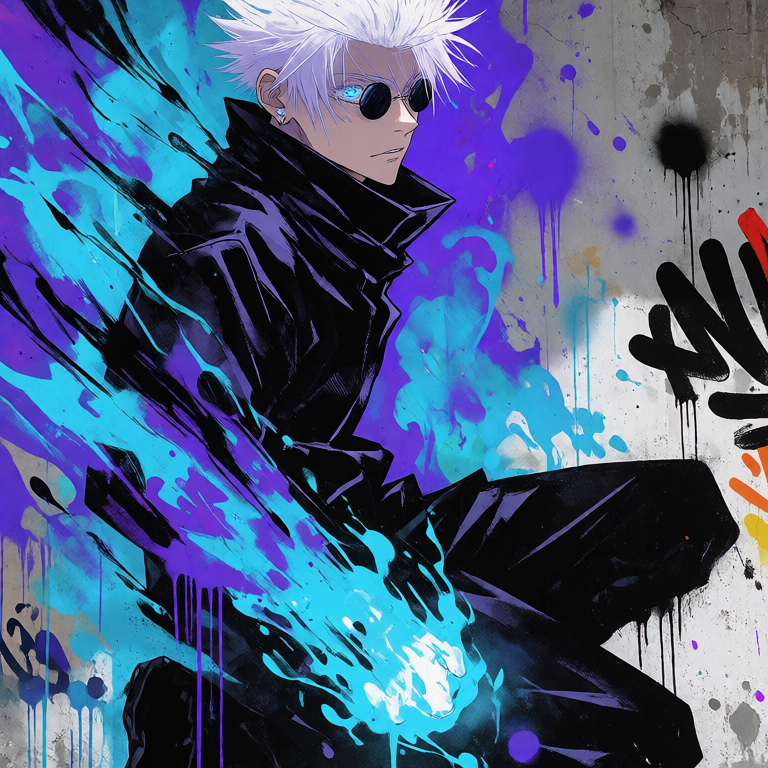
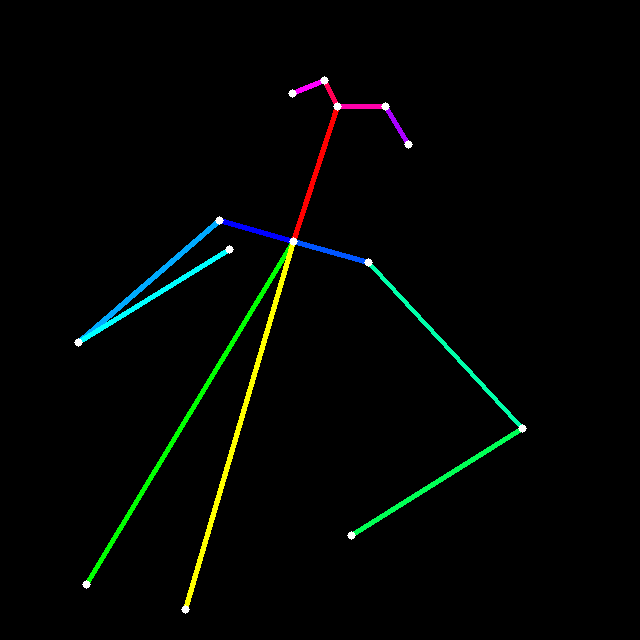
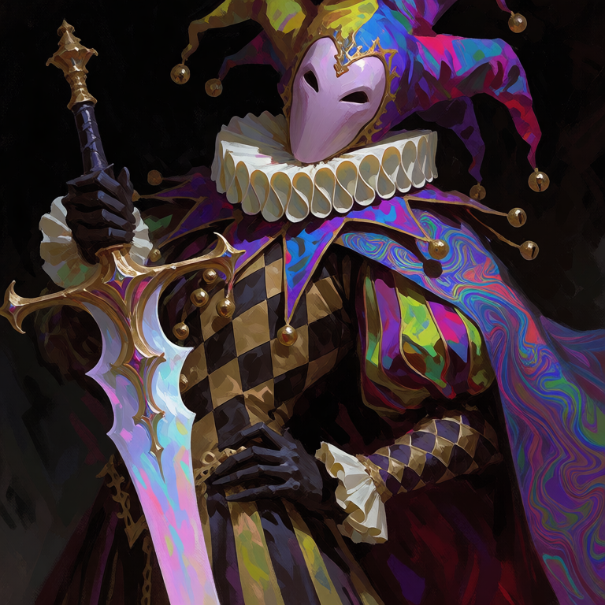

# Krea-2 Pose Control-LoRA

Skeleton-conditioned pose control for Krea-2 using a Control-LoRA-style adaptation. A rendered pose skeleton supplies body geometry while text supplies compatible appearance, style, clothing, materials, lighting, and environment.

> **Current status:** production training is complete through the current candidate checkpoints. The two active candidates are **parent-4000** (safer / more balanced) and **A4300** (more pose-specialist). The annealed/B branch is historical only.

---

## Showcase

### Fantasy Mage

| Pose condition | Generation |
|---|---|
|  |  |

### Gojo-inspired Mural

| Pose condition | Generation |
|---|---|
|  |  |

### Dark-fantasy Jester

| Pose condition | Generation |
|---|---|
|  |  |

<p align="center">
  <strong>Pose condition → generated interpretation</strong>
</p>

> Franchise-inspired examples are fan-art-style demonstrations only. They are not official affiliations, endorsements, or claims about training data.

---

## What this project does

- Accepts a rendered human-pose skeleton as the control input.
- Encodes the pose image with the same VAE family used for image latents.
- Spatially aligns the pose-control latent with the noisy image latent.
- Injects pose control through an expanded `ControlInputLayer`.
- Adapts Krea-2 with LoRA while keeping the pretrained backbone frozen.
- Trains the control state against **Krea-2 Raw**.
- Evaluates and deploys the trained control state with **Krea-2 Turbo**.

The pose condition is intended to carry **body geometry**, not source-image semantics. Text remains responsible for compatible identity, style, clothing, materials, lighting, and environment.

---

## Architecture

The control-input expansion used here was informed by [Tanmay Patil's Krea-2 ControlNet repository](https://github.com/Tanmaypatil123/Krea-2-controlnet), which demonstrates depth-conditioned control for Krea-2. This repository adapts that general control-input approach to skeleton-based pose conditioning and develops the pose data pipeline, training objective, pose-consistency supervision, evaluation, inference tooling, and checkpoint recipe used here.

At each spatial token location, the model concatenates the noisy image latent with the clean VAE-encoded pose-control latent. `ControlInputLayer` projects that widened feature vector into the existing model width.

The image half of the expanded input projection is initialized from the pretrained model. The control half starts from zero, so the untrained expanded model is initially insensitive to the skeleton and learns control behavior during optimization.

| Component | Configuration |
|---|---|
| Backbone | Krea-2 Raw |
| Transformer blocks | 28 |
| Control | Spatially aligned VAE pose latent |
| Control injection | Concatenation through `ControlInputLayer` |
| LoRA rank | 64 |
| LoRA alpha | 64 |
| LoRA targets | 8 modules per block |
| Total LoRA targets | 224 |
| Trainable state | `ControlInputLayer` + LoRA tensors |
| Trainable parameters | ~215.49M |

At a high level, flow matching uses:

```text
x_t = t * noise + (1 - t) * x0
target velocity = noise - x0
x0_hat = x_t - t * v_hat
```

where `x0` is the clean image latent, `x_t` is the noisy image latent, and the pose-control latent remains clean.

---

## Training objective

The canonical production objective is **not flow-MSE-only**.

It combines:

1. flow-matching MSE, and
2. explicit pose-consistency supervision.

Conceptually:

```text
loss = flow_loss + lambda_pose * pose_loss
```

The canonical production/control branch uses:

```text
lambda_pose = 0.04
pose loss   = normalized-coordinate Huber
pose window = approximately [0.10, 0.20]
forced pose exposure probability = 0
```

The pose-consistency path reconstructs `x0_hat`, decodes it, evaluates predicted human keypoints with a frozen fixed-box Keypoint R-CNN path, and compares normalized predicted/reference joint coordinates using Huber loss.

The consistency-feedback idea was inspired by [ControlNet++: Improving Conditional Controls with Efficient Consistency Feedback](https://arxiv.org/abs/2404.07987), Li et al., ECCV 2024. This repository's normalized-coordinate Huber formulation is project-specific and is **not** claimed to be ControlNet++'s exact loss.

---

## Training recipe

| Setting | Production value |
|---|---|
| Precision | BF16 |
| Seed | 42 |
| Microbatch | 1 |
| Gradient accumulation | 32 |
| Effective batch | 32 |
| Optimizer | AdamW |
| Betas | `(0.9, 0.99)` |
| Weight decay | `0` |
| Base LR | `1e-4` |
| Warmup | 200 optimizer steps |
| Max gradient norm | `1` |
| Geometry | Dynamic 768 bucket training |
| Loader workers | 4 |
| Persistent workers | On |
| Pinned memory | On |
| Prefetch factor | 4 |
| Gradient checkpointing | Off |
| `torch.compile` | Off |
| Fused AdamW | Off |

The production training sequence included:

- initial production training,
- cooldown / consolidation,
- finishing-branch comparison.

The current serious candidates are:

| Checkpoint | Role |
|---|---|
| **parent-4000** | Safer / more balanced candidate |
| **finish-control A4300** | Stronger pose-specialist candidate |

The annealed/B branch remains historical evidence only and is not a current release candidate.

---

## Resolution policy

Production training uses a fixed dynamic-768 bucket policy:

```text
768x768
704x896
896x704
640x960
960x640
576x1024
1024x576
512x1152
1152x512
```

Inference also supports explicit dimensions, provided width and height satisfy the runtime requirements.

---

## Evaluation

Evaluation uses a locked Krea-2 Turbo contract:

```text
steps = 8
CFG   = 0
mu    = 1.15
```

The runtime uses the official Turbo schedule with no resolution-dependent `mu` shift.

Pose evaluation includes:

- Keypoint R-CNN detections,
- confidence threshold `>= 0.5`,
- deterministic Hungarian person matching,
- bbox-diagonal-normalized PCK,
- unmatched reference people counted as failures,
- detection coverage,
- CLIP image-text similarity.

### Split terminology

- **Diagnostic split** — development / selection benchmark.
- **Validation split** — held out from training, but subsequently inspected and used for inference benchmarking.

The validation split should therefore **not** be described as an untouched final test set.

### Current checkpoint interpretation

- **parent-4000** is the safer, more balanced candidate.
- **A4300** is more pose-committed and is the current pose-specialist candidate.
- **B / anneal** is historical only.

These are development findings, not state-of-the-art claims.

---

## Inference

`inference.py` is the canonical local inference entry point.

Example:

```bash
PYTHONPATH=. python inference.py \
  --turbo-ckpt /path/to/turbo.safetensors \
  --pose-lora-ckpt /path/to/checkpoint.pt \
  --prompt "young woman, platinum-blonde bob, structured black fashion outfit, crimson studio background, cinematic directional lighting, high-fashion editorial photography" \
  --pose-image /path/to/control.png \
  --output /path/result.png \
  --seed 42 \
  --width 768 \
  --height 768 \
  --steps 8 \
  --cfg 0 \
  --mu 1.15 \
  --control-scale 1.0
```

The canonical Turbo runtime enforces:

```text
8 steps
CFG 0
mu 1.15
```

Explicit width/height are supported together. The shared production dynamic-768 geometry can be used with:

```bash
--dynamic-768-bucket
```

instead of explicit width and height.

Each generated image is accompanied by a JSON sidecar containing provenance such as:

- prompt,
- seed,
- width / height,
- geometry mode,
- Turbo settings,
- control scale,
- pose image path,
- Turbo checkpoint path,
- pose-LoRA checkpoint path,
- checkpoint step,
- output path.

### Python API

`inference.py` also exposes reusable integration surfaces including:

- `PoseInferenceRequest`
- `PoseInferenceResult`
- `generate_pose(...)`
- `InferenceRuntime`

This is intended to support future integrations without duplicating sampling logic.

ComfyUI support is not implemented yet.

---

## Prompting and prompt curation

Current inference testing suggests that pose adherence is strongest when the prompt describes **what the image should look like**, while the skeleton specifies **how the body should be arranged**.

In practice, the model is more reliable when text focuses on:

- subject identity / archetype,
- clothing,
- materials,
- color palette,
- lighting,
- environment,
- rendering style,
- artistic medium.

Text can compete with the pose condition when it also tries to control:

- limb placement,
- stance,
- torso direction,
- body orientation,
- framing,
- camera angle,
- subject count.

Portrait-heavy prompts have been the hardest current qualitative cases.

### Prompt features to treat carefully

| Prompt feature | Typical effect | Recommendation |
|---|---|---|
| `close-up`, `portrait` | Can override full-body framing | Avoid when preserving full-body pose is important |
| `low angle`, `over-the-shoulder` | Can impose viewpoint / torso geometry | Use only when compatible with the skeleton |
| `hand on hip`, `arms raised` | Directly competes with limb placement | Let the control specify limbs |
| `full body` | Can help preserve figure extent when compatible | Use only when it matches the control |
| multiple-person wording | Can change subject assignment | Match subject count to the condition |

### Less reliable for strict pose adherence

```text
close-up portrait of a woman looking over her shoulder,
one hand on her hip, one arm raised, low-angle view
```

### Better

```text
young woman, platinum-blonde bob, structured black couture outfit,
crimson studio background, cinematic directional lighting,
high-fashion editorial photography
```

When exact pose adherence matters, let the pose condition specify:

- limb placement,
- stance,
- torso direction,
- body orientation.

### Condition curation

For showcase-quality outputs:

- prefer complete, readable skeletons,
- avoid sparse or truncated conditions,
- match subject count between prompt and control,
- avoid severe pose/framing conflicts,
- prefer clean single-person controls for single-person prompts.

Current showcase selection uses **COCO and Human-Art conditions**. Danbooru pose controls are not part of the current showcase curation policy.

These are current empirical observations and should not yet be treated as a complete formal limitation study.

---

## Conditioning and data

Conditioning and evaluation material spans multiple human-centric domains, including:

- COCO-derived human examples,
- Human-Art painting,
- Human-Art real-human,
- Human-Art sculpture.

Third-party source material remains the property of its respective owners. This repository does not claim ownership of those datasets or imply that all third-party-derived imagery is freely redistributable.

At inference time, the skeleton is intended to convey **pose geometry only**. It is not intended to recover source-image identity, clothing, background, or scene semantics.

See [`docs/ARCHIVE_INDEX.md`](docs/ARCHIVE_INDEX.md) for historical experiment organization and redistribution-review notes.

---

## Repository layout

| Path | Purpose |
|---|---|
| [`inference.py`](inference.py) | Canonical Turbo pose-generation CLI and Python API |
| [`scripts/train_production.py`](scripts/train_production.py) | Production training launcher |
| [`pose_controlnet/production_training.py`](pose_controlnet/production_training.py) | Production training mechanics, resume, checkpointing |
| [`pose_controlnet/pose_consistency.py`](pose_controlnet/pose_consistency.py) | Canonical pose-consistency training path |
| [`pose_controlnet/pose_critic.py`](pose_controlnet/pose_critic.py) | Reusable fixed-box pose critic components |
| [`pose_controlnet/pose_loss.py`](pose_controlnet/pose_loss.py) | Reusable pose-loss composition |
| [`pose_controlnet/training_runtime.py`](pose_controlnet/training_runtime.py) | Shared production training runtime helpers |
| [`pose_controlnet/turbo_runtime.py`](pose_controlnet/turbo_runtime.py) | Locked Turbo sampling/runtime |
| [`pose_controlnet/resolution_policy.py`](pose_controlnet/resolution_policy.py) | Shared native / dynamic-768 geometry policy |
| [`data/manifests/`](data/manifests/) | Train, validation, and diagnostic manifests |
| [`docs/inference_eval/`](docs/inference_eval/) | Preserved inference-evaluation evidence |
| [`docs/assets/showcase/`](docs/assets/showcase/) | Curated README/social showcase assets |
| [`docs/ARCHIVE_INDEX.md`](docs/ARCHIVE_INDEX.md) | Historical experiment index |

---

## Training and resume

The canonical production training entry point is:

```text
scripts/train_production.py
```

Use the script's current CLI as the source of truth for exact run and resume flags.

The production path supports:

- atomic local checkpoints,
- exact resume,
- optimizer restoration,
- scheduler restoration,
- data-position restoration,
- RNG restoration,
- checkpoint identity validation,
- local durable telemetry,
- failure-isolated W&B mirroring,
- asynchronous Hugging Face checkpoint mirroring when configured.

Remote logging or mirroring failures are not intended to interrupt local training.

---

## Current status

Completed:

- skeleton-conditioning pipeline,
- production training,
- explicit pose-consistency supervision,
- dynamic-resolution training,
- exact checkpoint resume,
- locked Krea-2 Turbo inference,
- quantitative diagnostic evaluation,
- parent-4000 / A4300 comparison,
- prompt/pose qualitative evaluation,
- canonical local inference API,
- initial curated showcase generation.

Current candidates:

```text
parent-4000
A4300
```

Current public showcase shortlist:

```text
fantasy mage
Gojo-inspired mural
dark-fantasy jester
```

---

## Roadmap

Planned work includes:

- checkpoint interpolation / mixing between parent-4000 and A4300,
- broader control-scale evaluation,
- deeper prompt-conflict evaluation,
- additional curated showcase generations,
- final README hero grid,
- style-LoRA composition experiments,
- ComfyUI wrapper,
- Hugging Face demo,
- final technical write-up.

Checkpoint interpolation is currently **planned / experimental** and should not be interpreted as implemented or validated.

---

## References, prior work, and acknowledgements

- **Krea-2** — [official Krea-2 repository](https://github.com/krea-ai/krea-2) and [technical report](https://www.krea.ai/blog/krea-2-technical-report). This project follows Krea's Raw-for-training / Turbo-for-inference setup.

- **Tanmay Patil** — [Krea-2 ControlNet](https://github.com/Tanmaypatil123/Krea-2-controlnet), a public depth-conditioned Krea-2 ControlNet implementation that informed the control-input approach used in this project.

- **ControlNet** — Lvmin Zhang, Anyi Rao, and Maneesh Agrawala, [*Adding Conditional Control to Text-to-Image Diffusion Models*](https://arxiv.org/abs/2302.05543), ICCV 2023.

- **ControlNet++** — Ming Li et al., [*ControlNet++: Improving Conditional Controls with Efficient Consistency Feedback*](https://arxiv.org/abs/2404.07987), ECCV 2024. The consistency-feedback idea influenced the explicit pose-consistency supervision used here; this repository's normalized-coordinate Huber loss is project-specific.

- **LoRA** — Edward J. Hu et al., [*LoRA: Low-Rank Adaptation of Large Language Models*](https://arxiv.org/abs/2106.09685).

- **Flow Matching** — Yaron Lipman et al., [*Flow Matching for Generative Modeling*](https://arxiv.org/abs/2210.02747).

- **Rectified Flow** — Xingchao Liu, Chengyue Gong, and Qiang Liu, [*Flow Straight and Fast: Learning to Generate and Transfer Data with Rectified Flow*](https://arxiv.org/abs/2209.03003).

- **COCO** — Tsung-Yi Lin et al., [*Microsoft COCO: Common Objects in Context*](https://arxiv.org/abs/1405.0312), ECCV 2014.

- **Human-Art** — Xuan Ju et al., [*Human-Art: A Versatile Human-Centric Dataset Bridging Natural and Artificial Scenes*](https://arxiv.org/abs/2303.02760), CVPR 2023. [Official project/code](https://github.com/IDEA-Research/HumanArt).

- **Training methodology** — Andrej Karpathy, [*A Recipe for Training Neural Networks*](https://karpathy.github.io/2019/04/25/recipe/). The project's staged overfit, debug, and scale-up workflow was influenced by this methodology.

- **CLIP** — Alec Radford et al., [*Learning Transferable Visual Models From Natural Language Supervision*](https://arxiv.org/abs/2103.00020).

- **Mask R-CNN / Keypoint R-CNN** — Kaiming He et al., [*Mask R-CNN*](https://arxiv.org/abs/1703.06870), together with the [torchvision Keypoint R-CNN implementation](https://docs.pytorch.org/vision/stable/models/generated/torchvision.models.detection.keypointrcnn_resnet50_fpn.html) used for pose-related scoring and supervision.
