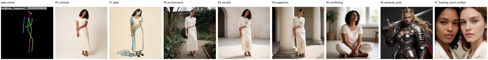
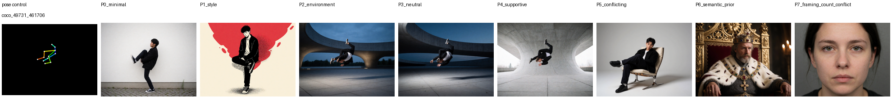
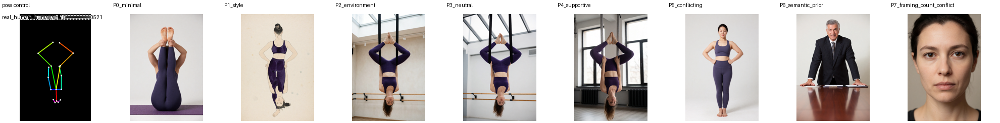
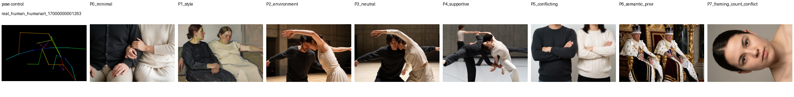
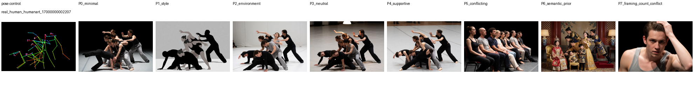
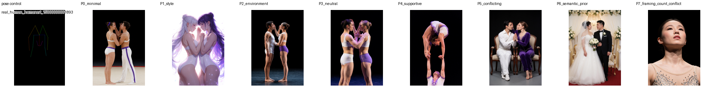
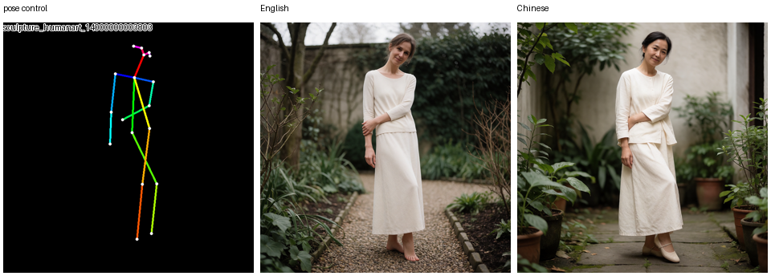

# Prompting Krea-2 Pose Control

Krea-2 Pose Control works best when the **pose condition defines body geometry** and the text prompt defines the **appearance and rendering of the image**.

This guide is based on controlled experiments with fixed pose controls, fixed sampling seeds, the same `mix-025` candidate, native/aspect-preserving geometry, and the locked Krea-2 Turbo inference contract:

- 8 sampling steps
- CFG 0
- `mu = 1.15`
- control scale 1.0

The central rule is:

> **Pose image = geometry. Prompt = appearance and rendering.**

If the prompt explicitly or implicitly asks for a different body configuration, the text prior can compete with the pose condition.

---

## Quick start

A reliable default prompt structure is:

```text
[subject count + subject],
[clothing / appearance],
[environment],
[lighting],
[rendering / camera / medium]
```

For example:

> A single adult woman wearing a simple cream outfit in a quiet botanical courtyard, soft overcast daylight, natural textures, realistic editorial photography.

Notice that the prompt does **not** describe detailed limb placement.

---

# Controlled prompting study

We evaluated eight representative pose conditions with eight prompt modes while keeping the control image, seed, model candidate, geometry, and sampler fixed.

The study covered:

- simple single-person poses
- dynamic airborne poses
- floor / seated / crouched poses
- inversion
- suspended/extreme poses
- two-person interaction
- two-person overhead configurations
- multi-person groups


## Prompt modes

| Mode | Meaning |
|---|---|
| `P0_minimal` | Subject + basic clothing only |
| `P1_style` | Minimal prompt + strong visual style |
| `P2_environment` | Subject + clothing + environment/lighting |
| `P3_neutral` | Rich prompt with no explicit pose instruction |
| `P4_supportive` | Broad action wording compatible with the skeleton |
| `P5_conflicting` | Explicit body configuration incompatible with the skeleton |
| `P6_semantic_prior` | Strong archetype/prop language with an implicit canonical pose |
| `P7_framing_count_conflict` | Framing or subject-count instruction incompatible with control |

## Aggregate results

| Prompt mode | PCK@0.05 | PCK@0.10 | PCK@0.20 | CLIP |
|---|---:|---:|---:|---:|
| Minimal | 0.2387 | 0.3086 | 0.4568 | 0.2920 |
| Style-heavy | 0.1193 | 0.1893 | 0.2634 | **0.3272** |
| Environment | **0.3086** | **0.4033** | 0.4938 | 0.3012 |
| Pose-neutral | 0.3004 | 0.3663 | 0.4815 | 0.3200 |
| Pose-supportive | 0.2428 | 0.3704 | **0.5021** | 0.3241 |
| Pose-conflicting | 0.0453 | 0.1193 | 0.2757 | 0.2995 |
| Strong semantic prior | 0.1111 | 0.1934 | 0.3909 | 0.3180 |
| Framing / count conflict | **0.0000** | **0.0165** | **0.0617** | 0.2883 |

## Main findings

1. **Environment-rich prompts gave the strongest strict pose adherence.** They provide useful scene information without forcing new body geometry.
2. **Pose-neutral prompts are a strong general default.** Describe what the subject looks like and where they are, then let the control image specify the body configuration.
3. **Broad compatible action wording can help unusual poses.** Short phrases such as `suspended in an athletic performance` can explain difficult geometry without replacing the control with text instructions.
4. **Explicit pose conflicts strongly reduce pose fidelity.** Asking an inverted subject to stand upright, or an airborne subject to sit, creates direct competition between text and control.
5. **Strong semantic archetypes can carry pose priors.** Words such as `king`, `warrior`, `bride and groom`, `knight`, or props such as a throne or giant sword may cause Krea-2 to reconstruct a familiar pose.
6. **Framing and subject-count conflicts were the strongest failure mode.** A full-body skeleton combined with `close-up portrait`, or a two-person skeleton combined with `one person`, can largely override the intended geometry.
7. **Strong style prompting can trade pose fidelity for text/style alignment.** Style prompting works, but aggressive style language should be introduced incrementally when pose accuracy is important.

---

# Recommended prompting rules

## 1. Let the condition control the body

Use the pose image to determine:

- limb placement
- torso orientation
- body configuration
- joint relationships
- interaction geometry
- broad spatial arrangement of people

Use the prompt primarily for:

- subject identity
- clothing
- hairstyle
- colors
- materials
- environment
- lighting
- photographic treatment
- art medium
- visual style

Avoid reproducing detailed joint geometry in text.

## 2. Start with subject, clothing and environment

A good first prompt is intentionally simple:

```text
A single adult woman wearing a simple cream outfit in a quiet botanical courtyard, soft overcast daylight, natural textures.
```

This gives the model enough semantic information to render the scene while leaving pose geometry to the control.

## 3. Pose-neutral prompts are the safest default

Prefer:

```text
A single young adult wearing a black jacket, dark trousers and sneakers, futuristic concrete plaza, dramatic blue-hour lighting, crisp editorial photography.
```

over:

```text
A young adult with the left knee raised, torso bent, right arm horizontal, left arm pointing downward...
```

The second prompt duplicates information already present in the pose image and increases the chance that text and control disagree.

## 4. Use compatible action wording for difficult poses

For unusual geometry, one broad compatible action phrase can help.

Useful examples:

```text
suspended in an athletic performance
```

```text
captured in a dynamic airborne moment
```

```text
moving together in a partnered dance
```

```text
low to the floor on an exercise mat
```

Avoid detailed joint instructions. The goal is to explain **what kind of action is happening**, not to redraw the skeleton in language.

## 5. Never intentionally contradict the pose unless testing failure behavior

If the control shows an inverted subject, avoid:

```text
standing straight with both feet on the floor
```

If the control shows an airborne subject, avoid:

```text
sitting calmly in a lounge chair
```

If you want a different body configuration, change the pose-control image.

## 6. Match framing to the control

A full-body pose control should usually be paired with compatible framing.

Good:

- full-body editorial photography
- environmental portrait
- wide fashion photography
- performance photography
- full-length figure

Risky:

- close-up portrait
- head and shoulders only
- passport photograph
- face-only beauty shot

Framing conflict produced the worst aggregate pose result in the controlled study.

## 7. Match subject count

For a one-person skeleton:

```text
A single adult woman...
```

For a two-person skeleton:

```text
Two adult performers...
```

For a group skeleton:

```text
A group of adult performers...
```

Do not ask for one person from a multi-person control or several people from a single-person control unless you intentionally want to override the condition.

## 8. Introduce strong semantic archetypes carefully

Certain concepts carry their own learned composition.

Examples:

- warrior
- knight
- king
- queen
- bride and groom
- ballerina
- mounted rider
- corporate executive
- superhero

Likewise, props can strongly imply geometry:

- throne
- chair
- horse
- motorcycle
- bicycle
- sword
- spear
- musical instrument
- dining table

Instead of immediately writing:

```text
A heroic warrior queen holding a giant sword...
```

start with:

```text
A woman wearing detailed silver fantasy armor...
```

Then add stronger semantic details one at a time.

## 9. Add style incrementally

Strong style descriptions can work, but they may weaken pose adherence.

Recommended workflow:

1. Establish a prompt that follows the control.
2. Add the desired environment.
3. Add lighting/camera treatment.
4. Add style or medium.
5. Inspect pose adherence.
6. If pose drifts, reduce style/archetype language.

For example, start with:

```text
A single adult woman wearing a cream outfit in a quiet courtyard.
```

Then add:

```text
watercolor illustration, soft paper texture, restrained blue and ochre palette
```

rather than combining several strong style, character, prop, and framing instructions at once.

## 10. Keep prompts purposeful

Long prompts are not automatically better. Every additional semantic concept gives the base model another opportunity to introduce geometry that was not present in the pose condition.

A useful prompt often needs only:

1. subject
2. clothing/appearance
3. environment
4. lighting
5. rendering style

---

# Examples from the controlled study

## Example 1 — Environment-rich, pose-neutral prompt

**Condition:** `sculpture_humanart_14000000003803`

**Prompt**

> A single adult woman wearing a simple cream outfit in a quiet botanical courtyard, soft overcast daylight, natural textures.

**Why it works:** the prompt adds clothing, environment, and lighting while leaving detailed body geometry to the pose condition.



## Example 2 — Dynamic airborne pose

**Condition:** `coco_49731_461706`

**Prompt**

> A single young adult wearing a black jacket, dark trousers and sneakers, futuristic concrete plaza, dramatic blue-hour lighting, crisp editorial photography.

**Why it works:** scene and visual treatment are specified, but the skeleton remains responsible for the airborne body configuration.



## Example 3 — Pose-supportive inversion

**Condition:** `real_human_humanart_15000000000521`

**Prompt**

> A single adult woman suspended upside down in an aerial studio, wearing a fitted dark violet athletic outfit, realistic editorial photography.

**Why it works:** a short compatible phrase explains the unusual geometry without trying to specify individual joints.



## Example 4 — Two-person interaction

**Condition:** `real_human_humanart_17000000001263`

**Prompt**

> Two adults moving together in a partnered dance, wearing charcoal and cream clothing, large concrete performance hall, realistic editorial photography.

**Why it works:** subject count matches the control and the interaction wording is broad rather than joint-specific.



## Example 5 — Multi-person group

**Condition:** `real_human_humanart_17000000002207`

**Prompt**

> A group of adult performers wearing simple black and gray clothing, vast minimalist hall, overhead light, realistic performance photography.

**Why it works:** the prompt preserves group semantics without forcing a new interaction.



---

# Failure examples

## Explicit pose conflict

**Condition:** inverted subject.

**Conflicting prompt**

> A single adult woman standing straight with both feet on the floor, wearing a fitted dark violet athletic outfit, realistic studio photography.

The text and control directly disagree.


## Strong semantic prior

**Condition:** simple standing figure.

**Prompt**

> A heroic fantasy warrior queen wearing ornate silver armor and carrying a massive sword, dramatic cinematic lighting.

Concepts such as `warrior`, armor, and a large weapon carry strong learned composition priors and can pull the generation away from the condition.


## Framing conflict

**Condition:** full-body dynamic skeleton.

**Prompt**

> A tightly framed passport-style headshot of the person, face and shoulders only, plain gray background.

The model may prioritize the requested crop and discard controlled full-body geometry.


## Subject-count conflict

**Condition:** two-person pose.

**Prompt**

> A solo portrait of one performer only, close-up from the chest upward.

One of the largest failure sources is asking the prompt and condition to represent different numbers of people.



---

# Pose-class observations

| Pose class | PCK@0.05 | PCK@0.10 | PCK@0.20 | Detection coverage |
|---|---:|---:|---:|---:|
| `dynamic_airborne` | 0.0000 | 0.0341 | 0.1136 | 1.000 |
| `floor_seated_crouched` | 0.0441 | 0.1544 | 0.3529 | 0.875 |
| `inversion` | 0.1324 | 0.1838 | 0.3529 | 1.000 |
| `multi_person_group` | 0.1963 | 0.2722 | 0.3925 | 0.839 |
| `simple_single` | **0.4485** | **0.6250** | **0.7279** | 1.000 |
| `suspended_extreme` | **0.4531** | 0.5469 | 0.7266 | 1.000 |
| `two_person_interaction` | 0.0792 | 0.1292 | 0.2625 | 0.938 |
| `two_person_overhead` | 0.0089 | 0.0446 | 0.0625 | 0.938 |

These values are diagnostic. Each pose class here is represented by one condition evaluated under eight prompt variants, so they should not be read as a general benchmark of every pose in that category.

The practical takeaway is that difficult and multi-person geometry benefits from more conservative prompting.

---

# Multi-person prompting

For multi-person conditions:

- match the number of subjects
- avoid introducing extra people
- avoid removing people through singular wording
- avoid assigning a completely new interaction
- keep role descriptions simple
- use broad compatible interaction language if needed
- avoid independently specifying every limb

Good:

```text
Two adults moving together in a partnered dance, wearing charcoal and cream clothing, large concrete performance hall, realistic editorial photography.
```

Risky:

```text
Two adults standing far apart with their arms folded...
```

when the pose condition shows interacting bodies.

---

# Difficult poses

For inversion, airborne poses, crouching, lying, suspension, foreshortening, and overlapping bodies:

```text
[subject]
+ [one broad compatible action phrase]
+ [appearance]
+ [environment]
+ [rendering]
```

Example:

```text
A single adult woman suspended in an athletic performance, wearing a fitted black and gold outfit, dark theatrical environment, cinematic photography.
```

The action phrase should describe the **category of motion** rather than exact joint positions.

---

# Multilingual prompting

A small English-versus-Chinese sanity test was run using:

- the same pose condition
- the same sampling seed
- the same `mix-025` candidate
- the same native geometry
- the same Turbo settings
- semantically matched prompts

English:

> A single adult woman wearing a simple cream outfit in a quiet botanical courtyard, soft overcast daylight, natural textures.

Chinese:

> 一位成年女性，穿着简洁的奶油色服装，身处安静的植物庭院中，柔和的阴天天光，自然真实的材质质感。



Both generations qualitatively preserved the supplied pose.

This is a **sanity test**, not a comprehensive multilingual benchmark. It supports basic Chinese prompting, but it should not be interpreted as evidence that all languages or all Chinese prompts behave identically to English.

The same general rules apply:

- let the pose image define geometry
- match subject count
- avoid framing conflict
- avoid contradictory pose instructions
- use appearance/environment/style language conservatively

---

# Practical workflow

## Step 1 — Start simple

```text
A single adult woman wearing a simple cream outfit.
```

## Step 2 — Add environment

```text
A single adult woman wearing a simple cream outfit in a quiet botanical courtyard, soft overcast daylight.
```

## Step 3 — Add rendering treatment

```text
A single adult woman wearing a simple cream outfit in a quiet botanical courtyard, soft overcast daylight, realistic editorial photography.
```

## Step 4 — Check pose adherence

If the result follows the condition, continue.

## Step 5 — Add stronger style or character concepts one at a time

This makes it easier to identify which phrase causes pose drift.

## Step 6 — For difficult geometry, add one compatible action phrase

For example:

```text
captured in a dynamic airborne moment
```

Do not describe individual joints unless you intentionally want text to compete with the pose control.

---

# Common failure patterns

## Conflicting body state

Control:

```text
inverted / suspended
```

Prompt:

```text
standing straight with both feet on the floor
```

Result: text and control directly compete.

## Framing conflict

Control:

```text
full-body skeleton
```

Prompt:

```text
tight head-and-shoulders portrait
```

Result: the model may crop away the controlled body.

## Subject-count conflict

Control:

```text
two people
```

Prompt:

```text
a solo portrait of one person
```

Result: one controlled person may disappear or geometry may be reconstructed.

## Strong semantic prior

Control:

```text
ordinary standing figure
```

Prompt:

```text
armored king seated on a golden throne
```

Result: throne/king semantics can impose a new canonical pose.

## Too many strong concepts at once

```text
close-up portrait of two armored warriors sitting on thrones while holding giant swords...
```

This simultaneously changes:

- framing
- subject count
- body state
- props
- interaction
- semantic archetype

These conflicts compound.

---

# Recommended default recipe

For most generations:

```text
[subject count + subject],
[clothing / appearance],
[environment],
[lighting],
[medium / camera / rendering style]
```

Example:

```text
A single adult woman wearing a simple cream outfit, in a quiet botanical courtyard, soft overcast daylight, natural textures, realistic editorial photography.
```

For difficult geometry, optionally add one broad compatible phrase:

```text
suspended in an athletic performance
```

```text
moving together in a partnered dance
```

```text
captured in a dynamic airborne moment
```

---

# Summary

The most reliable mental model is:

> **Pose image = body geometry**

> **Prompt = subject appearance + environment + rendering**

The prompt can still influence geometry, especially through explicit action words, framing, subject count, strong archetypes, and geometry-heavy props.

When pose accuracy matters:

1. start pose-neutral
2. match subject count
3. match framing
4. add environment and lighting
5. add style gradually
6. use only broad compatible action wording for difficult poses
7. simplify the prompt if the model begins to drift away from the condition

The complete controlled study and evaluation artifacts live under:

```text
docs/evaluation/prompting-guide/
```
