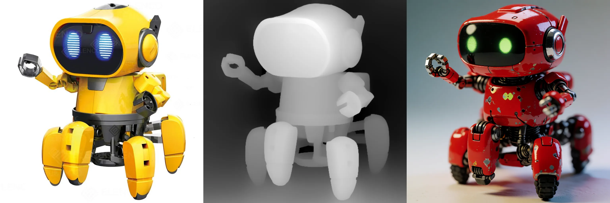

# Krea-2 Depth ControlNet-LoRA

Depth-conditioned generation for [Krea-2](https://github.com/krea-ai/krea-2). Give it any image and a prompt — it extracts the depth map with Depth-Anything-V2 and generates a new image with the **same 3D structure** and composition, but whatever content and style you ask for.

- Trained on **Krea-2-Raw**, works on both **Raw** and **Krea-2-Turbo** (8-step)
- Single 862MB LoRA file (rank 64 + expanded input projection), base stays frozen
- Depth consistency (Pearson corr. of input depth vs. depth of generated image): **0.98** with no prompt, **0.99** with prompts

*Each strip: init image → extracted depth → generated output.*

## Examples




## Checkpoint

| file | base trained on | size |
|---|---|---|
| [`depth-control-lora.safetensors`](https://huggingface.co/Patil/Krea-2-depth-controlnet/blob/main/depth-control-lora.safetensors) | krea/Krea-2-Raw | 862MB |

## Setup

```bash
git clone https://github.com/Tanmaypatil123/Krea-2-controlnet.git
cd Krea-2-controlnet
pip install -r requirements.txt

hf download Patil/Krea-2-depth-controlnet depth-control-lora.safetensors --local-dir .
```
## Inference

```bash
# Turbo base — fast, recommended (8 steps, no CFG)
python inference.py photo.jpg -p "a futuristic spaceship interior, cinematic lighting" \
    --lora depth-control-lora.safetensors

# Raw base — undistilled (28-52 steps, CFG 3.5)
python inference.py photo.jpg -p "..." --lora depth-control-lora.safetensors \
    --base raw

# No prompt: the depth map is the only signal
python inference.py photo.jpg --lora depth-control-lora.safetensors --save-strip

# Weaker structure adherence (more creative freedom)
python inference.py photo.jpg -p "..." --lora depth-control-lora.safetensors --lora-scale 0.6
```

| flag | default | notes |
|---|---|---|
| `-p / --prompt` | `""` | empty = depth-only generation |
| `--base` | `turbo` | `turbo` or `raw` |
| `--steps` | 8 turbo / 28 raw | |
| `--cfg` | 0 turbo / 3.5 raw | classifier-free guidance |
| `--mu` | 1.15 turbo / auto raw | timestep shift |
| `--lora-scale` | 1.0 | control-strength dial |
| `--seed` | 0 | |
| `--save-strip` | off | also saves input\|depth\|output comparison |

### Python API

```python
from PIL import Image
from huggingface_hub import hf_hub_download
from pipeline import DepthLoRAPipeline

base = hf_hub_download("krea/Krea-2-Turbo", "turbo.safetensors")
pipe = DepthLoRAPipeline(base, "depth-control-lora.safetensors")

out, depth = pipe(Image.open("photo.jpg"),
                  prompt="a cozy cabin interior at dusk",
                  steps=8, cfg=0.0, mu=1.15, seed=0)
out.save("output.png")
```

## How it works (inference path)

1. The init image is resized to the nearest ~1MP aspect bucket and run through **Depth-Anything-V2-Large** → inverse depth map (near = white).
2. The depth map is encoded with the same **Qwen-Image VAE** the model uses for images, so control lives in latent space.
3. At every denoising step, the depth latent is **concatenated channel-wise** to the noisy latent (each DiT token: 64 → 128 dims). The expanded input projection + rank-64 LoRA on all 28 blocks (both included in the checkpoint) steer generation to follow the depth structure.
4. Standard Krea-2 flow-matching Euler sampling otherwise — same recipe as BFL's Flux.1-Depth-dev-lora.

## Tips & limitations

- **Best inputs**: photos / renders with real perspective. Flat 2D illustrations produce nearly-uniform depth maps, so control will be weak (garbage in, garbage out).
- Empty-prompt generation works (0.98 depth consistency) — useful for testing how much structure the control alone carries.
- `--lora-scale` below 1.0 relaxes structure adherence; above 1.0 tightens it at some quality cost.
- Krea-2-Raw generates up to ~1K resolution; outputs are capped at the ~1MP buckets.

## Training your own ControlNet-LoRA

The training code is in [`trainer/`](trainer/) and is **control-type agnostic**: the same recipe trains depth, canny, tile, gray, or any custom pixel-aligned control signal. See [trainer/README.md](trainer/README.md) for data preparation (local folder or HF dataset), the shard format, and training instructions.

```bash
# example: canny ControlNet-LoRA from a folder of captioned images
python trainer/prepare_data.py --source folder --input-dir ./my_images \
    --out-dir ./data --control-type canny
python trainer/train_control_lora.py --data-dir ./data --ckpt-dir ./ckpts \
    --raw-ckpt raw.safetensors --control-type canny
```

## Files

- `inference.py` — CLI
- `pipeline.py` — full pipeline: LoRA surgery, Qwen3-VL conditioner, VAE, depth estimator, flow sampler with control injection
- `mmdit.py` — unmodified DiT definition from the [krea-2 repo](https://github.com/krea-ai/krea-2)
- `k2_lora.py` — model surgery: expanded input projection + LoRA injection (used by the trainer)
- `trainer/` — data prep + training for any control type ([docs](trainer/README.md))

Model weights are subject to the [Krea 2 community license](https://www.krea.ai/krea-2-licensing).
